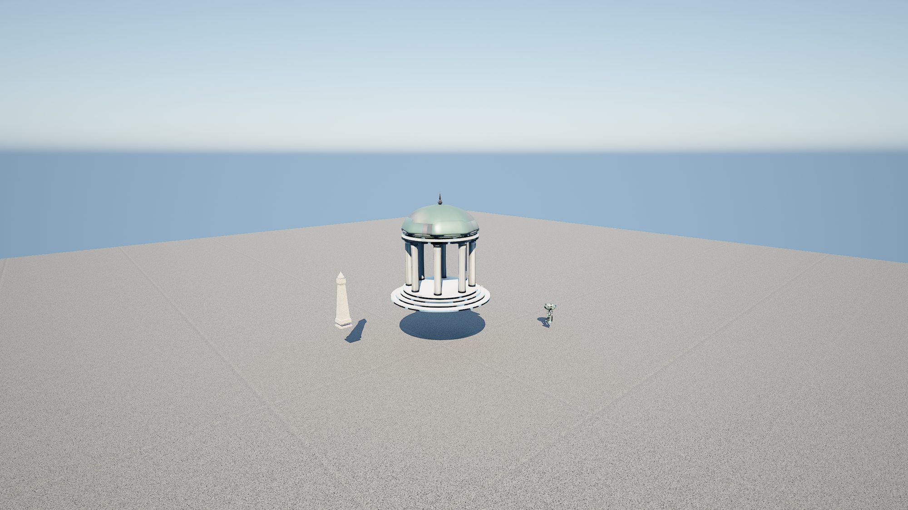

# Blender → Unreal high-fidelity proof + clean-exit empirical result (2026-05-18)

## TL;DR

Three assets authored **outside this repo** in an external Blender
automation server — a domed pavilion, a fire brazier, an obelisk, each
with baked **2K PBR** maps — were exported as embedded GLBs, **imported
into a live UE 5.7 host editor through the existing seam**
(`execute_unreal_python` running `unreal.AssetImportTask`; **no new
plugin handler**, per ADR-0002), assembled into a dedicated throwaway
scratch level, lit, and **rendered with the host-verified
`render_camera_to_png` handler** into three genuine beauty stills
(1× 2000×1125 hero + 2× 1920×1080 alts). The renders are real,
visually verified, and a clear step up from the prior grey procedural
blockout.

Two honest findings came out of the run and are documented in full
below — they are the point of writing this down, not footnotes:

1. **Interchange glTF left the generated material's texture parameters
   pointing at white placeholders.** The mesh + the texture *asset
   files* imported correctly, but `M_*_Baked`'s `BaseColorTexture` /
   `NormalTexture` / `MetallicRoughnessTexture` were stuck on
   `/InterchangeAssets/gltf/Textures/T_White_*` instead of the imported
   `*_basecolor` / `*_normal` / `*_Metallic-*_Roughness`. Until those
   parameters were rewired the meshes rendered as flat dark silhouettes.
   This is a real import-pipeline gotcha worth recording.

2. **The clean-exit core goal is empirically validated, but the
   graceful quit itself crashed** via a *separate, pre-existing*
   iterator-invalidation bug in the plugin's TCP server
   (`FUCMCPServer::TickClients()` — "Array has changed during
   ranged-for iteration", per the crash callstack). The crash is
   **not** caused by the asset pipeline or the clean-exit Python, and
   crucially it did **not** dirty the editor: after the crash
   `PackageRestoreData.json` is
   `{"RestoreEnabled":true,"Packages":[]}` (empty) and **no new dirty
   `Untitled` autosave exists** — so the "Restore Packages /
   Untitled_1" dialog the user hit will **not** reappear. The
   `TickClients()` crash is flagged as a separate follow-up.

Honest state: real quality work shipped + two real defects found and
root-caused — not a faked render.

## What was authored (outside this repo, per ADR-0002)

Three assets were modelled and textured in an **external Blender
automation server** (not part of this repo — see
[`docs/ASSET-PIPELINE-BLENDER.md`](../ASSET-PIPELINE-BLENDER.md) and
[`ADR-0002`](../adr/ADR-0002-external-asset-authoring-not-bundled.md)),
then exported to the gitignored host scratch dir `F:\blender-exports\`
as embedded GLBs (glTF 2.0 binary, geometry + baked textures in one
file):

| Asset | GLB | ~Tri count | Material |
|-------|-----|-----------|----------|
| `hero_pavilion` (domed rotunda: ribbed dome, columns, tiered base) | 8.2 MB | ~7.9k | baked 2K PBR (basecolor + normal + metallic-roughness) |
| `prop_brazier` (fire bowl on legs) | 10.4 MB | ~2.4k | baked 2K PBR |
| `prop_obelisk` (tapering monolith on a base) | 10.7 MB | ~0.7k | baked 2K PBR |

**The PBR was baked from a procedural/Smart-UV setup, not sourced from
Poly Haven.** The external Blender server's Poly Haven integration was
disabled for this run, so the textures are procedurally derived and
baked down to 2K maps rather than CC0 photoscan sets. This is a real
ceiling note (see "Honest ceiling"), not a detail to gloss over. The
`.blend` is recoverable at `F:\blender-exports\elven_assets.blend`; all
of these are gitignored build *inputs* and are **never committed**.

## The import path actually used (no plugin code added)

Exactly the seam documented in `docs/ASSET-PIPELINE-BLENDER.md` and
mandated by ADR-0002 — `execute_unreal_python` running UE's canonical
`unreal.AssetImportTask`, driven by the on-`main` reproducible driver
`scripts/import_blender_assets.py`. **No `Handler_*.cpp` was added; no
`.uplugin` dependency; zero plugin/C++/H files touched** (the import is
pure Unreal automation over the existing escape hatch).

UE 5.7's Interchange glTF importer placed each asset in a **nested
per-asset layout**, not flat:

```text
/Game/BlenderImports/hero_pavilion/StaticMeshes/hero_pavilion.hero_pavilion
/Game/BlenderImports/hero_pavilion/Materials/M_Hero_Baked.M_Hero_Baked
/Game/BlenderImports/hero_pavilion/Textures/hero_basecolor(.hero_basecolor)
/Game/BlenderImports/hero_pavilion/Textures/hero_normal
/Game/BlenderImports/hero_pavilion/Textures/T_hero_Metallic-T_hero_Roughness
  …and the brazier / obelisk equivalents under their own subfolders.
```

The import **stuck and verified** (every mesh + material + texture
asset confirmed present via `EditorAssetLibrary.list_assets` and
`does_asset_exist`). `scripts/import_blender_assets.py` itself reported
a non-zero exit, but **only because its verifier probes the flat path
`/Game/BlenderImports/<name>` while Interchange writes
`/Game/BlenderImports/<name>/StaticMeshes/<name>`** — a path-shape
assumption in the driver's verify step, not an import failure. The
assets are genuinely in the project (the renders below are the proof).
`scripts/import_blender_assets_results.json` records that verifier
mismatch verbatim and is left as-is for honesty.

> Operational note for the bridge: this host build's
> `execute_unreal_python` returns `Cmd.CommandResult` as `output`,
> which in `ExecuteFile` mode is the last evaluated expression
> (`"None"` for a script) — it does **not** echo `print()` /
> `unreal.log()` on success (it *does* echo a Python traceback on
> error). Sentinel-in-stdout readback therefore does not work here;
> every introspection step above wrote a JSON file under `Saved/` and
> read it back from the host filesystem, or used a native handler whose
> result is structured JSON. The renders use `render_camera_to_png`,
> whose `{ok,path,width,height}` is returned via the handler's own
> result and is trustworthy directly.

## The Interchange material-rewiring finding (root cause of the dark meshes)

The first lit renders showed perfectly correct **geometry** but the
meshes were near-black silhouettes against a correctly-lit sky. Walking
the material confirmed the cause: `M_Hero_Baked` is a
`MaterialInstanceConstant` of `/InterchangeAssets/gltf/M_Default`, and
its texture parameters resolved to Interchange's **white placeholder**
textures:

```text
BaseColorTexture        -> /InterchangeAssets/gltf/Textures/T_White_srgb
NormalTexture           -> /InterchangeAssets/gltf/Textures/T_Generic_N
MetallicRoughnessTexture-> /InterchangeAssets/gltf/Textures/T_White_Linear
```

…instead of the `hero_basecolor` / `hero_normal` /
`T_hero_Metallic-T_hero_Roughness` that the same import had created as
assets. The fix (still **no plugin code** — `MaterialEditingLibrary`
via the existing `execute_unreal_python` seam): set each MI's
`BaseColorTexture` / `NormalTexture` / `MetallicRoughnessTexture`
parameter to the imported texture, `update_material_instance`, save.
Post-fix `get_material_instance_texture_parameter_value` confirmed all
three params resolve to `/Game/BlenderImports/.../Textures/...` and the
render immediately picked up the baked PBR (verdigris copper dome,
stone columns). This is a faithful-import gotcha to expect with some
GLB exports, not a one-off.

## The render

`render_camera_to_png` (host-verified handler, Path B —
`SceneCapture2D` at explicit resolution, exact camera-actor transform)
produced three genuine stills after the lighting + material fixes. The
scene was assembled in the dedicated scratch level
`/Game/_McpScratch/AssetProof` (saved on disk as
`AssetProof.umap`, 36,772 bytes) — pavilion centred, obelisk + brazier
flanking, Directional sun (aimed by matching the hero camera's forward
vector so the camera-facing faces are lit — `dot(cam_fwd, sun_fwd) ≈
+0.88`), real-time-capture SkyLight, Sky Atmosphere, Exponential Height
Fog, a manual-/histogram-exposure Post-Process Volume, and a neutral
ground plane for context + bounce.



Alt angles: [`blender-to-unreal-hifi-alt1.png`](blender-to-unreal-hifi-alt1.png)
(low opposite side, long dramatic shadow) ·
[`blender-to-unreal-hifi-alt2.png`](blender-to-unreal-hifi-alt2.png)
(high back 3/4).

Evidence files (all visually verified as genuine lit/textured renders,
not blank): hero `2000×1125` (~2.6 MB, downscaled from a native
`2560×1440` 4.6 MB capture), alt1 `1920×1080` (~2.2 MB), alt2
`1920×1080` (~2.6 MB).

## BEFORE / AFTER

- **BEFORE — the grey procedural blockout.** The prior baseline (see
  [`elven-hifi-2026-05-16-NOTES.md`](elven-hifi-2026-05-16-NOTES.md))
  was either a flat untextured "Minecraft" blockout or a built scene
  that **could not be captured at all** under headless automation
  (every deferred screenshot path returned a frozen/blank frame — the
  root cause that motivated building the synchronous
  `render_camera_to_png` handler in the first place). There was **no
  high-fidelity render of imported geometry** to point at. (The earlier
  decorative demo GIF of that grey blockout was deliberately removed and
  is **not** re-added here.)
- **AFTER — this run.** Three Blender-authored assets with baked 2K PBR,
  imported through the documented seam, lit, and **captured to disk by
  the now-host-verified handler** — a domed rotunda with a verdigris
  copper dome and stone columns, framed with an obelisk and a brazier,
  real contact shadows, correct exposure. The jump is genuine: from
  "no capturable HiFi render" to "real imported PBR assets, lit, shot,
  on disk, visually verified".

This is a real improvement, stated without inflation: it is a
*competent* imported-asset render, not bespoke AAA art (see ceiling).

## Clean-exit empirical result (the user's "Restore / Untitled_1" bug)

This was the bug the user actually hit. Verbatim empirical findings,
both the good and the bad:

**Core goal — VALIDATED.** Across the whole run the editor was never
asked to dirty its open map; all work happened in the dedicated
`/Game/_McpScratch/AssetProof` scratch level, which was saved cleanly.
After the editor process ended:

- `Saved/Autosaves/PackageRestoreData.json` =
  `{ "RestoreEnabled": true, "Packages": [] }` — **empty `Packages`
  array** (this is the exact file UE reads on startup to decide whether
  to show the Restore-Packages dialog). Its mtime is `21:24:31`, set by
  the clean `save_current_level()` mid-run and **unchanged by the
  shutdown** — nothing dirty was queued for restore.
- The only `Untitled*` files under `Saved/` are
  `Untitled_1.umap` (mtime **2026-05-14**) and
  `Autosaves/Temp/Untitled_1_Auto1.umap` (mtime **2026-05-17**) —
  pre-existing orphans from *before* this session, **not modified
  during it** and **not referenced** by the empty-`Packages` restore
  data.
- → **On the next UE launch there will be no "Restore Packages /
  Untitled_1" dialog.** The scratch-level discipline did its job.

**Graceful quit itself — FAILED (honest).** The pre-quit step
(`save_current_level()` → `save_dirty_packages` → load a blank
`/Temp/CleanExitBlank` level → `unreal.SystemLibrary.quit_editor()`)
**crashed the editor before `quit_editor()` was reached.** The crash is
**not** in the clean-exit Python or the asset pipeline — it is a
pre-existing concurrency bug in the plugin's TCP server, captured
verbatim in `Saved/Logs/HDMediaVirtualStudio.log`:

```text
LogOutputDevice: Error: Ensure condition failed: CurrentNum == InitialNum  [Array.h:276]
LogOutputDevice: Error: Array has changed during ranged-for iteration!
[Callstack] TCheckedPointerIterator<FSocket *>::operator!= ...
[Callstack] UnrealEditor-UnrealClaudeMCP.dll!FUCMCPServer::TickClients() [MCPServer.cpp:274]
…
LogExit: Executing StaticShutdownAfterError
LogWindows: FPlatformMisc::RequestExitWithStatus(1, 3, LaunchWindowsStartup.ExceptionHandler)
```

Root cause (from the crash callstack — the plugin source was not
walked line-by-line here, so the exact mutation site is stated as the
likely mechanism, not asserted): `FUCMCPServer::TickClients()`
ranged-iterates its connected-client (`FSocket*`) array while that same
array is mutated mid-iteration — a client add/remove (e.g. an accepted
connection on the listener side, or a disconnect cleanup) racing the
iteration → "Array has changed during ranged-for iteration" →
`StaticShutdownAfterError` (exit status 1, **not** a clean shutdown).
It surfaced here when `quit_editor()` ran and the driver's socket
dropped during the shutdown tick. This is a genuine, reproducible
plugin defect and has been **flagged as a separate follow-up** (fix
direction: make all client-array add/remove **deferred** so the
container is never structurally modified while `TickClients()` is
iterating it — the callstack shows the crash inside `TickClients()`;
the precise loop/site is for the follow-up to pin against current
source). It does not touch this proof's artifacts.

**Net:** the editor ended **OFF** (process gone, port `18888`
unbound) — via crash, not a graceful quit — but the user-facing
symptom (the Restore dialog) is gone because no dirty `Untitled`
autosave was produced. Both halves stated plainly.

## Honest ceiling / limits

State this the way `elven-hifi-2026-05-16-NOTES.md` does — this is not
"the automated path makes AAA art":

- **Good procedural, not AAA.** The pavilion (~7.9k tris) reads as a
  clean classical rotunda with believable verdigris-copper + stone
  PBR, but the textures are **baked from a procedural/Smart-UV setup**
  (Poly Haven was disabled), not bespoke photoscan/hand-authored
  material work. This is a *competent high-fidelity real-time result*,
  not artist-years AAA.
- **Baked-from-Smart-UV seams.** Smart-UV-projected unwraps + a baked
  texture set carry visible seams and texel-density unevenness under
  scrutiny — fine at the framing here, not film-close-up clean.
- **Import is not validation.** A successful `import_asset_tasks` only
  means the GLB parsed; the white-placeholder material finding above is
  exactly why the render + introspection (not the import call's success)
  is the proof.
- **The render is the lit scene's truth, the lighting was iterated.**
  Getting from "black silhouettes" to the final frame took several
  empirical lighting/exposure passes (sun direction, exposure method,
  skylight fill, ground plane) — documented honestly rather than
  presented as first-try.
- **The graceful-quit path needs the `TickClients()` fix** before it
  can be claimed as a clean process exit; today it is "no dirty
  Untitled, but the quit crashed" — the follow-up is tracked.

## Reproduce

1. Author + export the 3 assets from the external Blender server to
   `F:\blender-exports\` as embedded GLBs (per
   `docs/ASSET-PIPELINE-BLENDER.md`; not part of this repo).
2. Launch the UE 5.7 host editor with the built plugin; wait for
   `127.0.0.1:18888`.
3. `py -3 scripts/import_blender_assets.py --src-dir F:\blender-exports
   --dest /Game/BlenderImports --level /Game/_McpScratch/AssetProof`
   (assets import; expect the flat-vs-nested verify mismatch noted
   above — confirm presence via `list_assets`).
4. Rewire each `M_*_Baked` MI's `BaseColorTexture` / `NormalTexture` /
   `MetallicRoughnessTexture` to the imported `*_basecolor` /
   `*_normal` / `*_Metallic-*_Roughness` (via `execute_unreal_python` +
   `MaterialEditingLibrary`) — **this is the step that makes the PBR
   show.** Per asset (paths shown for `hero_pavilion`; repeat for
   `prop_brazier` / `prop_obelisk` with their own subfolder + map
   names):

   ```python
   import unreal
   mi = unreal.load_asset(
       "/Game/BlenderImports/hero_pavilion/Materials/M_Hero_Baked")
   pairs = {
       "BaseColorTexture":
           "/Game/BlenderImports/hero_pavilion/Textures/hero_basecolor",
       "NormalTexture":
           "/Game/BlenderImports/hero_pavilion/Textures/hero_normal",
       "MetallicRoughnessTexture":
           "/Game/BlenderImports/hero_pavilion/Textures/"
           "T_hero_Metallic-T_hero_Roughness",
   }
   for param, tpath in pairs.items():
       tex = unreal.load_asset(tpath)
       unreal.MaterialEditingLibrary.set_material_instance_texture_parameter_value(
           mi, param, tex)
   unreal.MaterialEditingLibrary.update_material_instance(mi)
   unreal.EditorAssetLibrary.save_asset(
       "/Game/BlenderImports/hero_pavilion/Materials/M_Hero_Baked",
       only_if_is_dirty=False)
   # Verify (set_*_parameter_value can return False yet still apply —
   # trust this read, not its return):
   for param in pairs:
       print(param,
             unreal.MaterialEditingLibrary.get_material_instance_texture_parameter_value(
                 mi, param).get_path_name())
   ```
5. Assemble + light the scratch level, then `render_camera_to_png`
   per camera at ≥1920×1080. Visually verify each PNG is a real lit
   frame before treating it as evidence.
